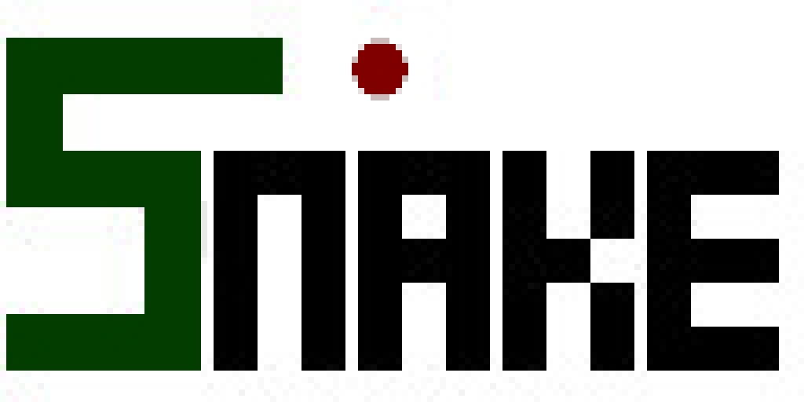
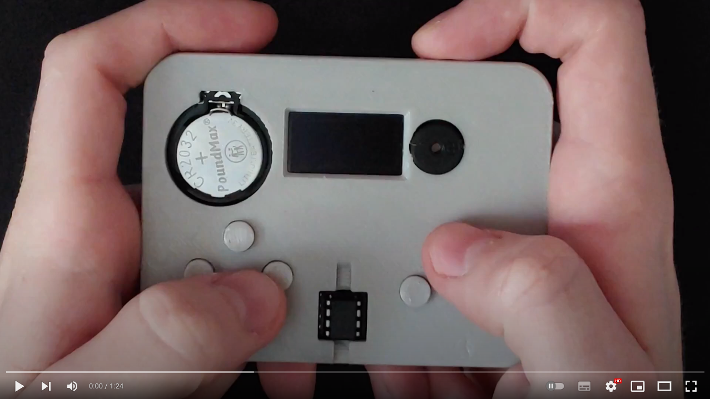

# ATtiny Snake

 

## Table of Contents

- [Introduction](#introduction)
- [Controls](#controls)
- [Game Objective](#game-objective)
- [Demonstration](#demonstration)
- [Credits](#credits)
- [Further Work](#further-work)

## Introduction

I created this game to run on my [ATtiny handheld games console](https://github.com/SeanP2001/ATtiny_Handheld_Games_Console). The game is a tribute to the original Snake game, featured on Nokia mobile phones at the turn of the millennium. 

Programming this game was a great way to practice using singly linked lists in C++. 

## Controls

| Button | Action               |
|:------:| -------------------- |
| Left   | Move the snake left  |
| Right  | Move the snake right |
| Up     | Move the snake up    |
| Down   | Move the snake down  |

In order to control the snake you must press and hold the direction button until the snake updates it's position.

## Game Objective

The objective of the game is to direct the snake to eat all of the apples. When the snake eats an apple it grows longer and your score increases. If the snake collides with itself, it's game over!

## Demonstration

## Credits

To create the game sounds I used the excellent code found [here](http://www.technoblogy.com/show?20MO) written by David Johnson-Davies. I highly recommend checking out David's website, especially for anything relating to the ATtiny microcontroller series.

## Further Work

In future I would like to:

- Add a directional pattern to the snake's body to make it clearer which direction it is moving in.
- Add slimmer block sprites which help to clarify the snake's shape when parts run side by side with each other.
- Add varying difficulty settings which would alter the speed of the snake's movement
- Add the option to play with borders, so the snake cannot wrap around the edges of the screen
- Add a mode to play against another snake, controlled by the ATtiny
